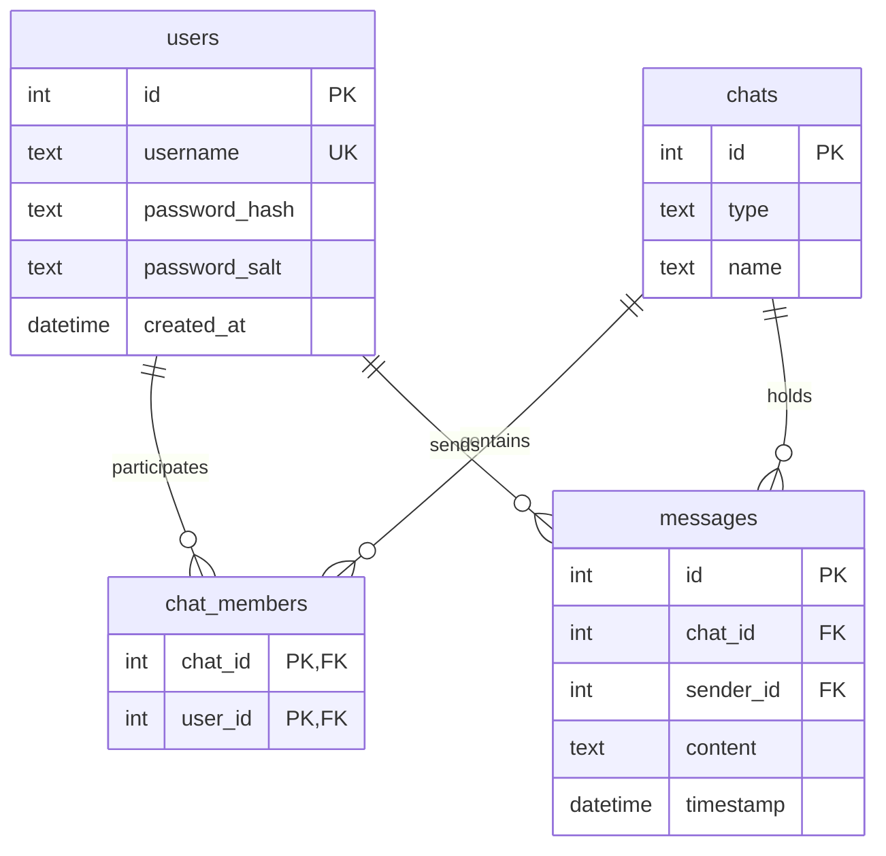

# TeslaMAX++ — Консольный мессенджер на C++

Многопользовательский мессенджер с архитектурой **клиент-сервер**, написанный на языке C++17. Сервер обрабатывает множество одновременных подключений в многопоточном режиме, управляет базой данных SQLite3 и обеспечивает маршрутизацию сообщений в реальном времени.

---

## Ключевые возможности

### Аутентификация и безопасность
- Регистрация и авторизация пользователей
- Хеширование паролей SHA-256 с уникальной солью
- Защита от SQL-инъекций через подготовленные выражения
- **Важно:** Текущая версия использует незащищённое TCP-соединение. Пароли хешируются на стороне сервера, но сам трафик не шифруется. Шифрование TLS/SSL запланировано в следующих версиях.

### Чаты и сообщения
- Личные чаты (1-на-1) с автоматическим поиском существующих диалогов
- Групповые чаты — создание и приглашение участников
- Отправка и получение сообщений в реальном времени
- История сообщений — загружается при входе в чат
- Уведомления о новых сообщениях из других чатов
- Выход из аккаунта без перезапуска клиента

### Архитектура
- Многопоточный TCP-сервер (отдельный поток на каждого клиента)
- Асинхронный клиент с фоновым потоком для приёма сообщений
- Потокобезопасность через мьютексы
- JSON-протокол обмена данными

### Логирование
- Потокобезопасный логгер с уровнями (DEBUG/INFO/WARN/ERROR)
- Запись всех событий сервера в файл с временными метками

---

## Архитектура проекта

Проект разделен на три ключевых модуля:

| Модуль | Директория | Описание |
|---|---|---|
| **server** | `src/server` | Многопоточный TCP-сервер с обработчиком пакетов и оберткой базы данных SQLite3. |
| **client** | `src/client` | Консольное приложение и асинхронный клиент. |
| **common** | `src/common`, `include/common` | Общие компоненты: сетевой протокол сериализации (`Packet`), потокобезопасный `Logger` событий и `Hasher` |

### Схема Базы Данных (SQLite3)

База данных сервера `messenger.db` автоматически инициализируется при первом запуске сервера с включенной поддержкой внешних ключей (`PRAGMA foreign_keys = ON`) и каскадным удалением:



---

## Сетевой протокол (JSON-based API)

Обмен информацией происходит посредством отправки сериализованных JSON-пакетов. Каждый пакет содержит тип (`PacketType`) и полезную нагрузку (`data`).

### Основные типы пакетов:

| ID | Имя типа пакета | Направление | Назначение |
|---|---|---|---|
| `1` | `REGISTER` | Client → Server | Регистрация нового аккаунта |
| `2` | `LOGIN` | Client → Server | Авторизация пользователя |
| `3` | `LOGOUT` | Client → Server | Выход пользователя из системы |
| `4` | `CREATE_PERSONAL_CHAT` | Client → Server | Создание личного чата |
| `5` | `CREATE_GROUP_CHAT` | Client → Server | Создание группового чата |
| `6` | `SEND_MESSAGE` | Client → Server | Отправка сообщения в чат |
| `7` | `ADD_GROUP_MEMBER` | Client → Server | Добавление участника в группу |
| `8` | `NEW_MESSAGE` | Server → Client | Push-уведомление о новом сообщении участникам |
| `9` | `GET_CHATS` | Client → Server | Запрос списка доступных чатов |
| `10` | `GET_CHAT_HISTORY` | Client → Server | Запрос истории переписки |
| `11` | `CHAT_LIST_RESPONSE` | Server → Client | Возврат списка чатов |
| `12` | `HISTORY_RESPONSE` | Server → Client | Возврат массива сообщений чата |
| `13` | `SUCCESS_RESPONSE` | Server → Client | Сообщение об успешном выполнении |
| `14` | `ERROR_RESPONSE` | Server → Client | Ошибка выполнения операции |

---

## Структура проекта

```
TeslaMAX++/
├── CMakeLists.txt              # Сборочная конфигурация CMake
├── messenger.db                # База данных SQLite3 (создаётся автоматически)
├── include/                    # Заголовочные файлы (.h)
│   ├── client/
│   │   └── Client.h            # Асинхронный TCP-клиент
│   ├── server/
│   │   ├── Server.h            # Многопоточный TCP-сервер
│   │   └── DataBaseManager.h   # Singleton-обёртка SQLite3
│   ├── common/
│   │   ├── Packet.h            # Сетевой протокол (JSON)
│   │   ├── PacketType.h        # Типы пакетов
│   │   ├── PacketUtils.h       # Утилиты сериализации
│   │   ├── Logger.h            # Потокобезопасный логгер
│   │   └── Hasher.h            # SHA-256 хеширование с солью
│   └── external/
│       └── json.hpp            # nlohmann/json (однофайловая библиотека)
└── src/                        # Файлы реализации (.cpp)
    ├── client/
    │   ├── main.cpp            # Точка входа клиента
    │   └── Client.cpp
    ├── server/
    │   ├── main.cpp            # Точка входа сервера
    │   ├── Server.cpp
    │   └── DataBaseManager.cpp
    └── common/
        ├── Logger.cpp
        └── Hasher.cpp
```

---

## Зависимости

| Зависимость | Версия | Назначение |
|---|---|---|
| **C++17** | ≥ 17 | Стандарт языка |
| **CMake** | ≥ 3.10 | Сборочная система |
| **SQLite3** | любая | База данных на стороне сервера |
| **nlohmann/json** | bundled | Сериализация пакетов |
| **POSIX Threads** | системная | Многопоточность |
| **OpenSSL** | любая | Шифрование данных |

### Установка зависимостей (Ubuntu/Debian)

```bash
sudo apt update
sudo apt install cmake build-essential libssl-dev libsqlite3-dev
```

---

## Сборка и запуск

```bash
# 1. Клонировать репозиторий
git clone https://github.com/Teslart461/Messenger_CourseWork.git
cd Messenger_CourseWork

# 2. Создать директорию для сборки
mkdir build && cd build

# 3. Сконфигурировать и собрать
cmake ..
make

# 4. Запустить сервер
./server

# 5. Запустить клиент
./client
```

> **Примечание:** Сервер слушает порт **8080** на `127.0.0.1`. Файл базы данных `messenger.db` создаётся автоматически рядом с исполняемым файлом сервера.

---
